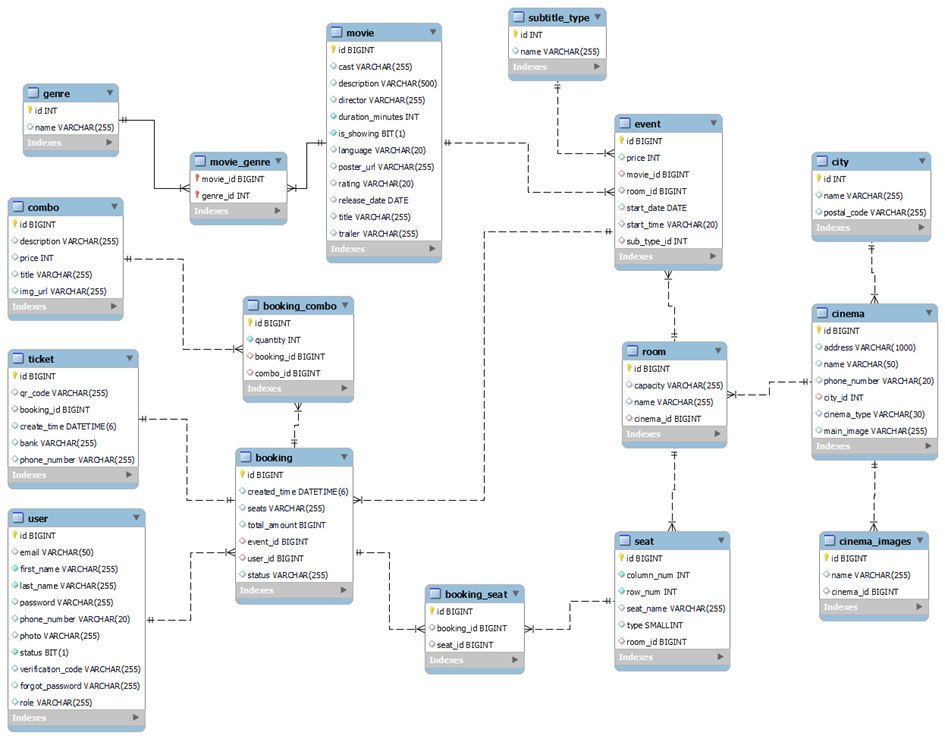
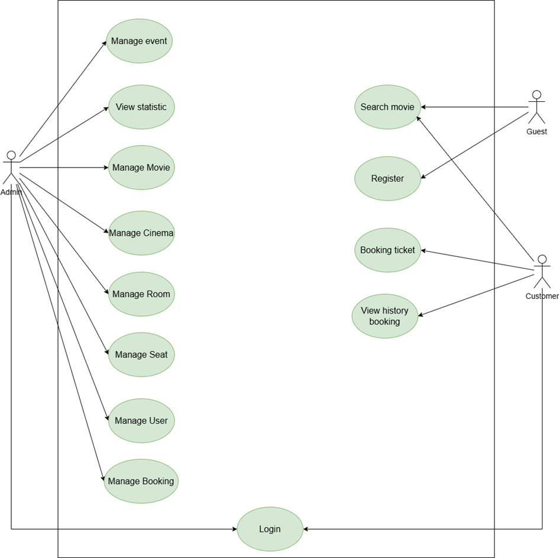

# Booking movie ticket website

## Table of Contents

- [Overview](#overview)
- [Features](#features)
- [User interfaces](#features)
- [Technologies Used](#technologies-used)
    - [Backend (Movie-api)]
    - [Frontend (Movie-ui)]
- [License](#license)
- [Getting Started](#getting-started)
- [Contributors](#contributors)

## Overview

The Booking movie website is a comprehensive full-stack application designed to booking movie ticket online. The project includes an Admin page for managing movies, cinemas, rooms, events and users. 
## Features
- Use Spring Security with JWT to secure user information.
- Use WebSocket to display real-time booking status.
- Use Spring Mail for account registration and password recovery.
- The project also builds an Admin page for managing movies, cinemas, rooms, events for booking movie.
- User with account can booking ticket online.
- Analytics: View statistics by custom date ranges.

## Technologies Used

### Backend (Elearning-be)

- Spring Boot 3
- Spring Security 6
- JWT Token Authentication
- Spring Data JPA
- JSR-303 and Spring Validation
- OpenAPI and Swagger UI Documentation
- Docker
- GitHub Action

### Frontend (Elearning-fe)

- Thymeleaf
- Bootstrap

## User interfaces
- Ideas from https://www.cgv.vn

## System design

#### ERD diagram

#### Usecasae diagram

## License

This project is licensed under the Apache License 2.0. See the [LICENSE](LICENSE) file for details.

## Getting Started

To get started with the Elearning project, follow the setup instructions in the respective directories:
- Clone this project
- Run cmd : docker compose up -d --build

## Contributors

- [NGO DUC THUAN](https://github.com/guma2k2)

