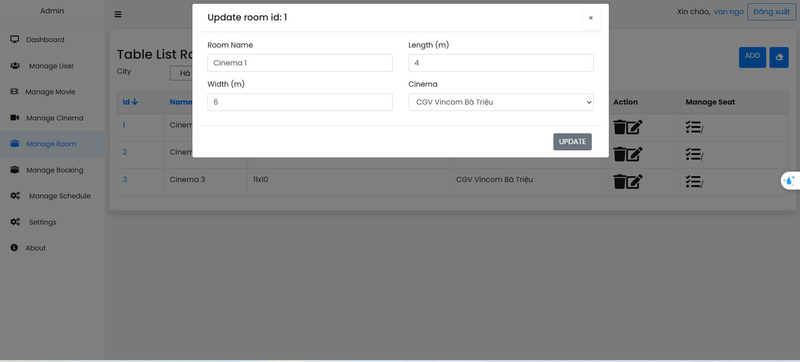
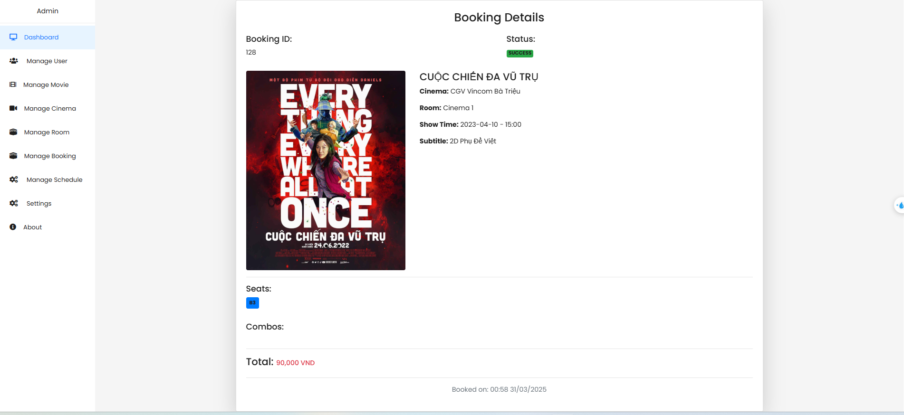

# Booking movie ticket website

## Table of Contents

- [Overview](#overview)
- [Features](#features)
- [System requirements](#system-requirements)
- [Technologies Used](#technologies-used)
    - [Backend](#backend)
    - [Frontend](#frontend)
- [System design](#system-design)
- [Features](#features)
    - [Features of Admin](#features-of-admin)
    - [Features of Customer](#features-of-customer)
- [License](#license)
- [Getting Started](#getting-started)
- [Contributors](#contributors)

## Overview

The Booking movie website is a comprehensive full-stack application designed to booking movie ticket online. The project includes an Admin page for managing movies, cinemas, rooms, events and users and an Client page for search movies, view showtimes, booking movie tickets and view payment history. 

## System requirements

- Users of the system should have an account with information such as user ID, email, full name, encrypted password, phone number, avatar, status, and role (admin or customer).
- The system should support two main roles: administrators who manage the system and customers who book tickets.
- Movies should have details including title, description, duration, screening status, language, release date, rating, poster image, trailer URL, and actors. Each movie can belong to multiple genres.
- Customers should be able to view and filter movies by cities, and release date.
- Movies should be linked to one or more screening events.
- Each screening event should have ticket price, start date and time, and the room where it will be held.
- The system should display the seating layout of a room and allow customers to select available seats.
- The system should prevent double booking of the same seat by two customers.
- When a customer books a ticket, a booking should be created containing one or more selected seats.
- Each booking may generate multiple tickets and include one or more combos.
- Customers should be able to pay via credit card(Ex: VNPAY, ...) 

## Features
- Use Spring Security with JWT to secure user information.
- Use WebSocket to display real-time booking status.
- Upload files with Cloudinary.
- Use Spring Mail for account registration and password recovery.
- The project also builds an Admin page for managing movies, cinemas, rooms, events, bookings for booking movie.
- User with account can booking ticket online and view payment history.
- Analytics: View statistics by custom date ranges.

## Technologies Used

### Backend 

- Spring Boot 3
- Spring Security 6
- JWT Token Authentication
- Spring Data JPA
- JSR-303 and Spring Validation
- OpenAPI and Swagger UI Documentation
- Docker
- GitHub Action

### Frontend 

- Thymeleaf
- Bootstrap
- Jquery

## System design

#### ERD diagram

#### Usecasae diagram

## Features
- User interfaces get ideas from https://www.cgv.vn

### Features of Admin
#### View revenue

Movie Revenue: Shows the revenue generated by each film, helping to identify the top-performing titles.

#### Manage User
Administrators can view the list of users, access detailed information, and edit user.
View list of users

ADD User

Update User

#### Manage movie
Admins can add new movies, update or delete existing ones, and view all movies currently available in the system.
View list of movies

ADD Movie

Update Movie

#### Manage Cinema
Admins can add, edit, delete, and view all cinemas within the system.
View list of cinema

Add Cinema

Update cinema

#### Manage Room
Admins can manage rooms(informations), including adding new rooms, editing, deleting, and viewing the full list.
View list of rooms

Add room

Update Room 

#### Manage seats
Admin can manage list of seats in room (information)
View list of seats

ADD seat

Update seat

#### Manage Showtimes
Admin can manage bookings by add, update, delete and view list of showtimes.
List of bookings by cinema, room and booking.

ADD Showtimes

Update Showtimes

#### Manage Orders
Admin can view list of orders, view detail of order.
View list of order

View order detail

### Features of Customer
#### Login, sign up
Users can access the system by entering their registered email and password, or by signing in with a Google account. The login interface is designed to be user-friendly and intuitive.

To create a new account, users must provide basic details including email, password, and full name. Once registered, they can log in and access the website's features.

Users can reset their account password using the email address they registered with.

#### Search movie
User can watch movie by release date

#### View detail of movie
Users can view detailed information for each movie, such as a brief summary, cast, director, runtime, genre, and trailer. This helps them get an overall impression and decide whether the movie is worth watching.

#### View events
Easily check movie showtimes by date or cinema. Pick a day to see what’s playing or select a movie to find where and when it’s showing. Plan your movie time with ease!

#### Booking ticket
Users can easily book movie tickets through the website by selecting a cinema, movie, showtime, and seats. Optional add-ons like popcorn and drinks are also available. Once selections are complete, users confirm the booking and pay securely via VNPay.

#### View order history
Users can view their payment history on the website to access QR codes.

## License

This project is licensed under the Apache License 2.0. See the [LICENSE](LICENSE) file for details.

## Getting Started

To get started with the Elearning project, follow the setup instructions in the respective directories:
- Clone this project
- Run cmd : docker compose up -d --build
- Access the link: http://localhost:8000

## Contributors

- [NGO DUC THUAN](https://github.com/guma2k2)

