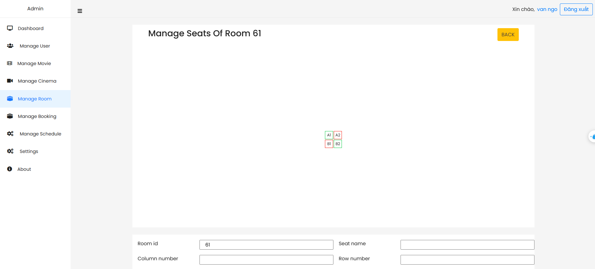

# Booking movie ticket website

## Table of Contents

- [Overview](#overview)
- [Features](#features)
- [System requirements](#system-requirements)
- [Technologies Used](#technologies-used)
    - [Backend](#backend)
    - [Frontend](#frontend)
- [System design](#system-design)
- [Features](#features)
    - [Features of Admin](#features-of-admin)
    - [Features of Customer](#features-of-customer)
- [License](#license)
- [Getting Started](#getting-started)
- [Contributors](#contributors)

## Overview

The Booking movie website is a comprehensive full-stack application designed to booking movie ticket online. The project includes an Admin page for managing movies, cinemas, rooms, events and users and an Client page for search movies, view showtimes, booking movie tickets and view payment history. 

## System requirements

- Users of the system should have an account with information such as user ID, email, full name, encrypted password, phone number, avatar, status, and role (admin or customer).
- The system should support two main roles: administrators who manage the system and customers who book tickets.
- Movies should have details including title, description, duration, screening status, language, release date, rating, poster image, trailer URL, and actors. Each movie can belong to multiple genres.
- Customers should be able to view and filter movies by cities, and release date.
- Movies should be linked to one or more screening events.
- Each screening event should have ticket price, start date and time, and the room where it will be held.
- The system should display the seating layout of a room and allow customers to select available seats.
- The system should prevent double booking of the same seat by two customers.
- When a customer books a ticket, a booking should be created containing one or more selected seats.
- Each booking may generate multiple tickets and include one or more combos.
- Customers should be able to pay via credit card(Ex: VNPAY, ...) 

## Features
- Use Spring Security with JWT to secure user information.
- Use WebSocket to display real-time booking status.
- Upload files with Cloudinary.
- Use Spring Mail for account registration and password recovery.
- The project also builds an Admin page for managing movies, cinemas, rooms, events, bookings for booking movie.
- User with account can booking ticket online and view payment history.
- Analytics: View statistics by custom date ranges.

## Technologies Used

### Backend 

- Spring Boot 3
- Spring Security 6
- JWT Token Authentication
- Spring Data JPA
- JSR-303 and Spring Validation
- OpenAPI and Swagger UI Documentation
- Docker
- GitHub Action

### Frontend 

- Thymeleaf
- Bootstrap
- Jquery

## System design

#### ERD diagram

#### Usecasae diagram

## Features
- User interfaces get ideas from https://www.cgv.vn

### Features of Admin
#### Xem doanh thu

Doanh thu theo phim: Thống kê doanh thu của từng bộ phim, giúp xác định các phim bán chạy nhất.

#### Quản lý người dùng
Admin có thể xem danh sách người dùng, xem chi tiết, sửa thông tin người dùng.
Danh sách người dùng

Thêm người dùng

Sửa người dùng

#### Quản lý phim
Admin có thể thực hiện các thao tác như thêm phim mới, sửa thông tin phim, xóa phim và xem danh sách tất cả các phim hiện có trên hệ thống.
Danh sách phim

Thêm phim

Sửa phim

#### Quản lý rạp chiếu
Admin có thể thêm mới, sửa đổi, xóa bỏ và xem danh sách các rạp chiếu phim trong hệ thống.
Danh sách rạp chiếu

Thêm rạp chiếu

Sửa rạp chiếu

#### Quản lý phòng
Admin có thể quản lý các phòng chiếu phim bằng cách thêm mới, sửa đổi, xóa bỏ và xem danh sách các phòng chiếu.
Danh sách phòng

Thêm phòng

Sửa phòng

#### Quản lý ghế
Admin cũng có thể quản lý danh sách ghế ngồi trong từng phòng chiếu.
Danh sách ghế

Thêm ghế

Sửa ghế

#### Quản lý lịch chiếu
Admin có thể quản lý các suất chiếu bằng cách thêm mới, sửa đổi, xóa bỏ và xem danh sách các suất chiếu.
Danh sách lịch chiếu theo rạp, phòng và ngày chiếu.

Thêm lịch chiếu

Sửa lịch chiếu

#### Quản lý đơn hàng
Admin có thể xem danh sách đơn hàng, xem chi tiết từng đơn hàng.
Danh sách đơn hàng

Chi tiết đơn hàng

### Features of Customer
#### Đăng nhập, đăng ký 
Người dùng chỉ cần nhập email và mật khẩu đã đăng ký hoặc sử dụng tài khoản google để đăng nhập vào hệ thống. Giao diện đăng nhập thân thiện và dễ sử dụng.

Người dùng cần cung cấp các thông tin cơ bản như email, mật khẩu và họ tên để tạo tài khoản mới. Sau khi đăng ký thành công, người dùng có thể đăng nhập và sử dụng các tính năng của trang web.

Người dùng có thể lấy lại mật khẩu của tài khoản qua email đã đăng ký.

#### Tìm kiếm phim
Người dùng có thể tìm kiếm phim theo ngày khởi chiếu

#### Xem thông tin chi tiết phim
Người dùng có thể xem thông tin chi tiết về mỗi bộ phim bao gồm tóm tắt nội dung, dàn diễn viên, đạo diễn, thời lượng, thể loại và trailer. Thông tin này giúp người dùng có cái nhìn tổng quan và quyết định xem có nên xem bộ phim đó hay không.

#### Xem lịch chiếu
Trang web cung cấp lịch chiếu phim theo ngày và theo rạp. Người dùng có thể chọn ngày chiếu để xem các phim đang chiếu trong ngày đó, hoặc chọn một bộ phim cụ thể để xem lịch chiếu tại các rạp. Tính năng này giúp người dùng dễ dàng lên kế hoạch xem phim theo thời gian biểu của mình.

#### Đặt vé xem phim 
Trang web cho phép người dùng đặt vé xem phim một cách dễ dàng. Người dùng có thể chọn rạp, chọn phim, chọn suất chiếu và chọn ghế ngồi theo sở thích. Ngoài ra, người dùng còn có thể chọn thêm các dịch vụ đi kèm như bỏng, nước. Sau khi hoàn tất việc chọn lựa, người dùng sẽ xác nhận đặt vé và thực hiện thanh toán qua VNPay.

#### Xem lịch sử mua hàng
Trang web cho phép người dùng xem lịch sử thanh toán để lấy QRCode.

## License

This project is licensed under the Apache License 2.0. See the [LICENSE](LICENSE) file for details.

## Getting Started

To get started with the Elearning project, follow the setup instructions in the respective directories:
- Clone this project
- Run cmd : docker compose up -d --build
- Access the link: http://localhost:8000

## Contributors

- [NGO DUC THUAN](https://github.com/guma2k2)

